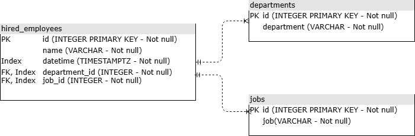

# Database Design

## Overview

This document describes the relational model implemented for the Globant
Data Engineering Challenge PoC. The schema follows the data dictionary
defined in the challenge document (`hired_employees`, `departments`, `jobs`)
with additional constraints and type decisions justified below.

---

## Entity-Relationship Diagram

> Save the diagram image as `docs/02-database/er-diagram.png` so this
> reference renders correctly.

**Cardinality:**
- `departments` 1 — N `hired_employees`
- `jobs` 1 — N `hired_employees`

---

## Design Decisions

### Primary Keys — No Auto-increment

`id` columns are declared as `INTEGER PRIMARY KEY`, **not** `SERIAL`/
`IDENTITY`. The challenge's data dictionary defines `id` as a required field
provided by the source (CSV rows and API request payloads both include it
explicitly). Auto-generating IDs would conflict with externally supplied
values and risk sequence/duplicate mismatches. Uniqueness is guaranteed by
the `PRIMARY KEY` constraint; any record missing a valid `id` is rejected
and logged per the challenge's validation rules — it is not auto-completed.

### `datetime` — TIMESTAMPTZ

`hired_employees.datetime` is stored as `TIMESTAMPTZ`, not `VARCHAR`. The
challenge's validation rules require strict ISO 8601 format including the
UTC designator (e.g. `2021-07-27T16:02:08Z`), which carries timezone
semantics that a plain string discards. Storing it as `TIMESTAMPTZ`:

- Enforces format validity at the database level as a second barrier
  (defense in depth, alongside application-level validation).
- Preserves the UTC semantics from the source `Z` suffix.
- Enables native date/time functions (`EXTRACT(QUARTER FROM ...)`,
  `date_trunc`) required by Challenge #2's quarterly aggregation, without
  runtime casting on every query.

### NOT NULL Constraints

All columns in all three tables are `NOT NULL`, mirroring the challenge's
"all fields are required" validation rule. Application-level validation
(Pydantic, Challenge #1 Section 3) is the first barrier and should reject
incomplete records before they reach the database; the `NOT NULL`
constraint is the second barrier — if a future bug in the validation layer
lets a null through, the database rejects it outright rather than silently
corrupting downstream analytics (Challenge #2 reports).

### Foreign Keys — ON DELETE Behavior

`hired_employees.department_id` and `hired_employees.job_id` reference
`departments.id` and `jobs.id` respectively, both with `ON DELETE RESTRICT`.

**Rationale:** `RESTRICT` blocks the deletion of a department or job while
any employee record still references it, rather than silently cascading
the delete (`CASCADE`) or nulling the reference (`SET NULL` — invalid here
regardless, since these columns are `NOT NULL`). This mirrors the same
integrity philosophy already enforced at the API layer: just as an
employee cannot be inserted with a non-existent `department_id`/`job_id`
(Challenge #1, Section 3), an existing department/job with hiring history
cannot be deleted out from under that history. For an HR hiring-record
domain, deleting a department/job with associated employees is very rarely
the intended operation — `RESTRICT` forces that decision to be made
explicitly (e.g. via an archival flag, out of this PoC's scope) rather than
allowing accidental, irreversible data loss.

---

## Indexing Strategy

**Decision: individual indexes**, not a composite index, on:
- `hired_employees.department_id`
- `hired_employees.job_id`
- `hired_employees.datetime`

(Primary key indexes on all three tables are created implicitly and not
declared separately.)

**Rationale:** for the data volume expected in this PoC, Postgres's query
planner can typically combine multiple individual indexes efficiently via
bitmap index scans, resolving the `GROUP BY department_id, job_id` +
year-filter query from Challenge #2 without a significant read-performance
penalty compared to a composite index. A composite index
`(department_id, job_id, datetime)` would add write overhead on every
`INSERT` (index maintenance cost) that is only justified at a data volume
this project does not reach. Composite indexing is documented here as a
known future optimization if data volume grows significantly.

---

## Implementation Note: SQLAlchemy Autoincrement Inference

SQLAlchemy 2.0's `Mapped[int]` with `primary_key=True` infers an implicit
`Identity()`/`SERIAL` sequence by default, even when the design explicitly
calls for externally-provided IDs (see "Primary Keys — No Auto-increment"
above). The first `alembic revision --autogenerate` silently created this
sequence, which contradicted the intended design.

**Fix:** explicit `autoincrement=False` was added to `mapped_column(...)`
for the `id` column in all three models. The migration was regenerated
after reverting (`alembic downgrade base`) and reapplying
(`alembic upgrade head`), and verified via `\d hired_employees` in `psql` —
the `Default: nextval(...)` clause is now absent, confirming IDs are
sourced exclusively from the ingested data, not auto-generated.

This is a reminder that ORM defaults do not automatically match explicit
design decisions — always verify the materialized schema against the
design document, not just the generated migration script.

---

## Schema Summary

| Table | Column | Type | Constraints |
|---|---|---|---|
| `departments` | `id` | `INTEGER` | `PRIMARY KEY`, `NOT NULL` |
| `departments` | `department` | `VARCHAR` | `NOT NULL` |
| `jobs` | `id` | `INTEGER` | `PRIMARY KEY`, `NOT NULL` |
| `jobs` | `job` | `VARCHAR` | `NOT NULL` |
| `hired_employees` | `id` | `INTEGER` | `PRIMARY KEY`, `NOT NULL` |
| `hired_employees` | `name` | `VARCHAR` | `NOT NULL` |
| `hired_employees` | `datetime` | `TIMESTAMPTZ` | `NOT NULL`, indexed |
| `hired_employees` | `department_id` | `INTEGER` | `NOT NULL`, `FK → departments.id`, indexed |
| `hired_employees` | `job_id` | `INTEGER` | `NOT NULL`, `FK → jobs.id`, indexed |